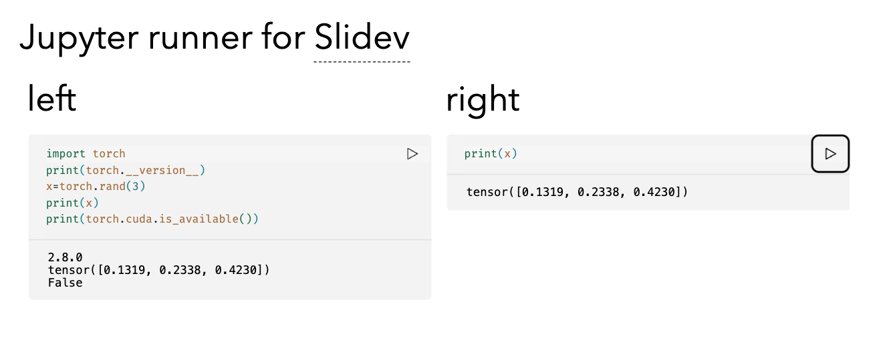

### `slidev-addon-jupyter-runner`

[![NPM][npm-badge]][npm-link]
[![License][license-badge]][license-link]
[![Deploy][deploy-badge]][deploy-link]

A jupyter notebook execution addon for [Slidev]'s Monaco Runner

<picture>
  <source media="(prefers-color-scheme: dark)" srcset="./.github/assets/screenshot-dark.png">
  
</picture>

## 🌟 Features

- 🖥️ In-slide Jupyter notebook execution
- Supports pdf exporting


## 📦 Installation

```bash
npm install slidev-addon-jupyter-runner
```

Enable the addon in your [Slidev](http://sli.dev) frontmatter:

```yaml
---
addons:
- slidev-addon-jupyter-runner
---
```

## 🛠️ Usage

Make sure you got jupyter notebook running. Use the following commandline to start jupyter notebook
```
jupyter notebook --NotebookApp.allow_origin="*" --NotebookApp.token="6d14bc192a64d2d07e3a0d7c6a1c878f0f1dc0fc1448d468"
```


---

**Happy Coding in Your Slides!** 🎉

[//]: (Externals)

[npm-badge]: https://img.shields.io/npm/v/slidev-addon-cpp-runner
[npm-link]: https://www.npmjs.com/package/slidev-addon-cpp-runner
[license-badge]: https://img.shields.io/github/license/SOHNE/slidev-addon-cpp-runner
[license-link]: https://github.com/SOHNE/slidev-addon-cpp-runner/blob/main/LICENSE
[deploy-badge]: https://github.com/SOHNE/slidev-addon-cpp-runner/actions/workflows/deploy.yml/badge.svg
[deploy-link]: https://github.com/SOHNE/slidev-addon-cpp-runner/actions/workflows/deploy.yml

[Slidev]: https://sli.dev
[Coliru]: https://coliru.stacked-crooked.com

[//]: (EOF)
